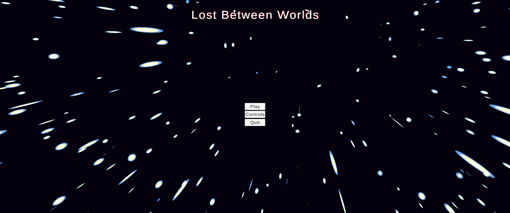
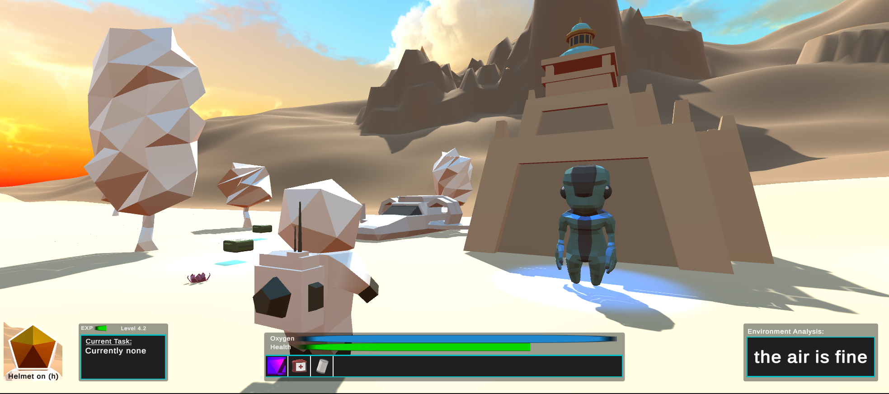

# Lost Between Worlds - Unity Project
Before ChatGPT: A Journey Through Time

## Project Overview
"Lost Between Worlds" is an adventure Unity game developed for Entertainment Computing at the University of Bremen, Germany, in 2021. It's a story of memory, discovery, and the choices we make, all unfolding in an immersive universe.

### Game Abstract
The player awakens in an unfamiliar world, tasked with piecing together their lost memories through exploration and puzzle-solving across various planets.

### Core Gameplay
A blend of exploration, puzzle-solving, and narrative-driven choices, set in a universe of diverse and richly designed worlds.

## Mechanics
### Game Elements
- NPCs, environments, items.
- Puzzles and strategic decision-making.

### Game World
- Diverse environments from technologically advanced hubs to natural landscapes.

## Assets List
- **Spacesuit Character Model**: [Stylized Astronaut](https://assetstore.unity.com/packages/3d/characters/humanoids/sci-fi/stylized-astronaut-114298)
- **Weapon Models**: 
  - [Sci-Fi Gun](https://quaternius.com/packs/scifigun.html)
  - [Laser Model](https://assetstore.unity.com/packages/tools/particles-effects/volumetric-lines-29160)
- **Collectable Models**: 
  - [2D Free Crystal Set](https://assetstore.unity.com/packages/2d/textures-materials/2d-free-crystal-set-175156)
  - [Survival Pack](https://quaternius.com/packs/survival.html)
- **Nature Assets**: 
  - [Low Poly Styled Trees](https://assetstore.unity.com/packages/3d/vegetation/trees/low-poly-styled-trees-43103)
  - [Grass and Flowers Pack](https://assetstore.unity.com/packages/2d/textures-materials/nature/grass-and-flowers-pack-1-17100)
- **Ground Textures** (for each planet style): [Hexlands Low Poly Style](https://assetstore.unity.com/packages/2d/textures-materials/tiles/hexlands-low-poly-style-133586)
- **Houses** (for each planet style): 
  - [Spaceships Pack](https://quaternius.com/packs/spaceships.html)
  - Quaternius Patreon Pack
- **Skyboxes** (for each planet style): [Fantasy Skybox Free](https://assetstore.unity.com/packages/2d/textures-materials/sky/fantasy-skybox-free-18353)
- **NPC Styles**: 
  - [Animated Alien](https://quaternius.com/packs/animatedalien.html)
  - [Animated Mech](https://quaternius.com/packs/animatedmech.html)
  - [Animated Robot](https://quaternius.com/packs/animatedrobot.html)
- **Background Music**: 
  - Archives VOL 1 THE DARK SIDE by Nicolas Jeudy - Dark Fantasy Studio
  - The vanishing of Elisabeth Rose - Dark Fantasy Studio

## Study

### Purpose
The study conducted for "Lost Between Worlds" aimed to evaluate various aspects of the game such as gameplay, user experience, narrative engagement, and overall player satisfaction. A total of 17 participants were involved in the study.

### Methodology
Participants were provided with the final game version playable on Windows, Linux, and macOS. After playing the game, they completed a questionnaire via Google Forms, designed to gather feedback on different elements of the game experience.

### Key Findings
- Participant Demographics: The study involved 17 participants with varying gaming frequencies.
- Gameplay Mechanics: The game was generally enjoyed by participants, with a mean enjoyment score of 4.0 (SD = 1.1).
- Teleportation Experience: Teleportation sequences effectively made participants feel like traveling to another world (M = 4.0, SD = 0.90).
- Quest Completion: Only 29.4% of participants managed to finish the game, indicating a moderate level of challenge.
- Narrative Engagement: Most participants agreed with the statement of feeling unknown in the game scenario (M = 5.0, SD = 0.49).
- Game Difficulty: The difficulty was rated as normal (M = 3.0, SD = 0.88).
- Control and UI: Some participants reported issues with the game controls and user interface.
- Player Reactions: The prototype was graded as median 2.0 (standard deviation of 1.33).
- Positive Feedback: Players praised the game’s music, animations, mystery, atmosphere, and certain game mechanics.
- Areas for Improvement: Feedback included fixing the quest bug, simplifying controls, improving NPC movement, and enhancing environmental details.

### Implications for Development
- Adjustments were made to the user interface and control systems based on the feedback.
- The quest bug and other reported issues were addressed and resolved.
- Despite the critical view on some aspects like controls and UI, the game was generally well-received, particularly in terms of its visual and auditory design.
- The research insights were instrumental in refining the game, although significant changes were limited due to time constraints.

Overall, the study revealed that while the game was largely appreciated for its narrative and aesthetic elements, there were areas in gameplay and mechanics that required further attention and improvement.

## Visuals and Sounds
### Visuals
- Atmospheric, stylized graphics.
- Character designs that reflect the diversity of worlds.

### Sounds
- Original soundtracks for each environment.
- Detailed sound effects for an immersive experience.

## Development and Technical Specifications
Developed using Unity, compatible with Linux, Windows, and Mac platforms.

### Internal Project Link
[Complete Game Design Document](https://github.com/eveetc/unity.lost-between-worlds.2021/blob/main/Game_Design_Document.pdf)

## Credits and Acknowledgements
- University of Bremen, Entertainment Computing, 2021

